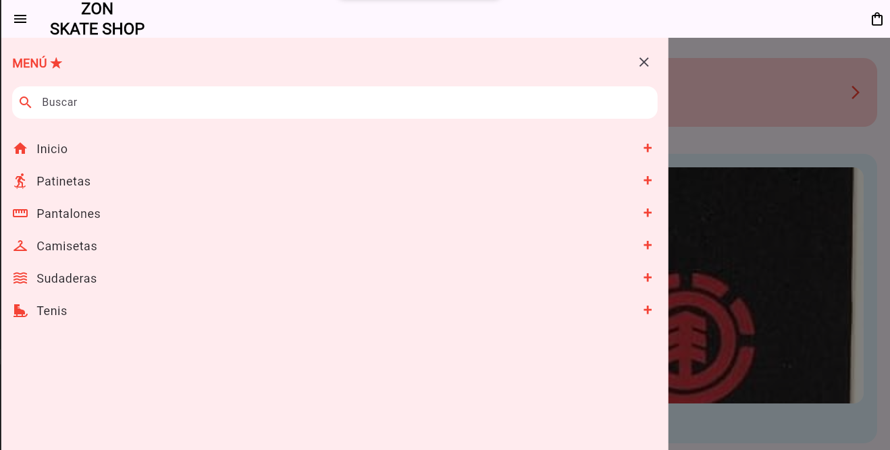
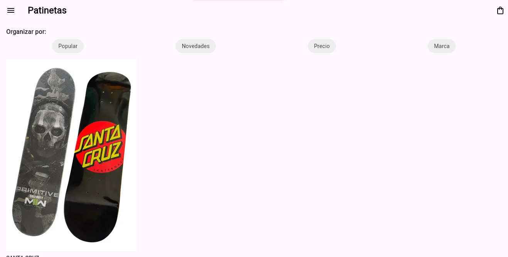
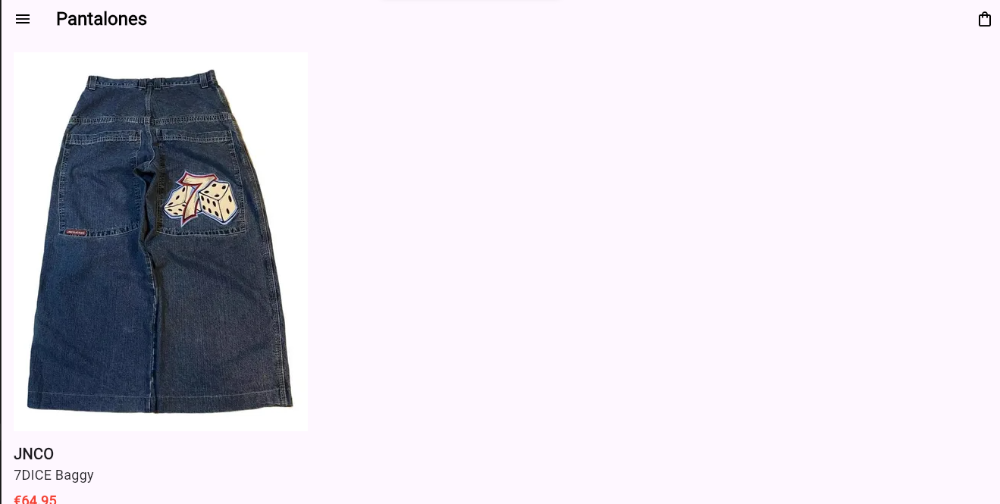
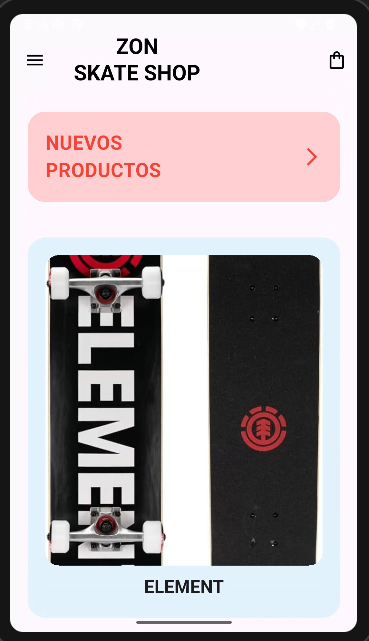
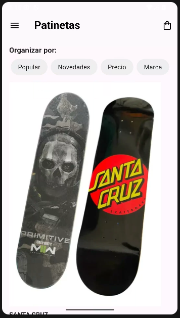
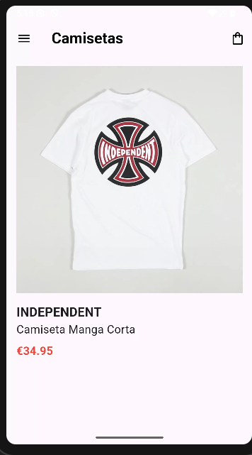

# myapp
# miprompt
LEnguaje dart flutter nivel principiante genera una fotografía de producto fotorrealista de alta resolución (8k) para una interfaz de comercio electrónico de una tienda de skate profesional, presentando un [PRODUCTO] centrado en el encuadre. El objeto debe estar capturado con una iluminación de estudio cinematográfica suave y difusa, diseñada específicamente para resaltar las texturas de los materiales y los colores reales, evitando sombras duras y brillos indeseados. El fondo debe ser un color crema pastel sólido y uniforme (código hexadecimal aproximado #FFF3E0), totalmente limpio y sin elementos distractores. El estilo visual general debe ser minimalista, moderno y urbano (streetwear aesthetic), con el producto perfectamente aislado para facilitar su integración en la interfaz de la aplicación móvil. El [PRODUCTO] debe mostrarse desde un ángulo de visión frontal, sin personas, con todos sus detalles nítidos y sin distorsiones, creando una imagen limpia y profesional lista para un catálogo digital
# web

# Android

